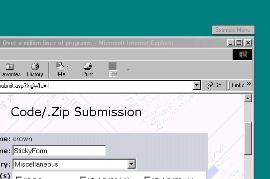



## StickyForm

### Description

Let your form atach itself to another window.
 
### More Info
 

             |
---                |---
**Submitted On**   |2001-07-14 14:58:00
**By**             |[crown](https://github.com/Planet-Source-Code/PSCIndex/blob/master/ByAuthor/crown.md)
**Level**          |Beginner
**User Rating**    |3.7 (11 globes from 3 users)
**Compatibility**  |VB 5\.0, VB 6\.0
**Category**       |[Miscellaneous](https://github.com/Planet-Source-Code/PSCIndex/blob/master/ByCategory/miscellaneous__1-1.md)
**World**          |[Visual Basic](https://github.com/Planet-Source-Code/PSCIndex/blob/master/ByWorld/visual-basic.md)
**Archive File**   |[StickyForm227687142001\.zip](https://github.com/Planet-Source-Code/crown-stickyform__1-25016/archive/master.zip)

